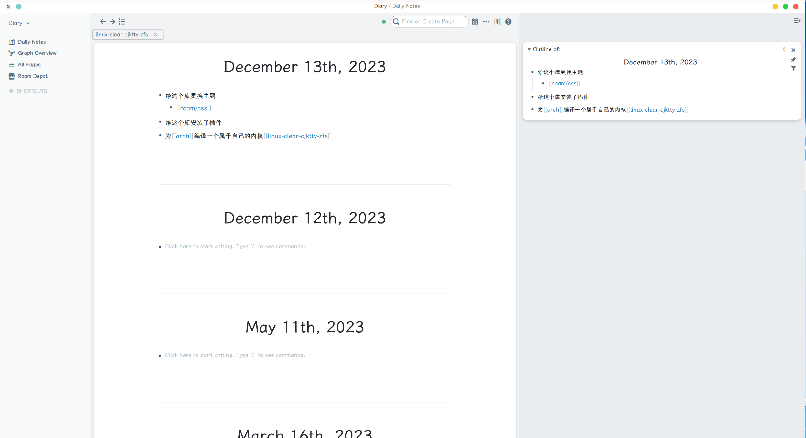

# Better Roam Research

这是 [Roam Research](https://roamresearch.com) 最受欢迎的最小主题之一,由我进行了更改

# 如何使用

1. 在 Roam Research 中，创建一个 `roam/css`命名的页面

2. 创建一个 `[[Better Roam Research]]` 块

3. 在其中创建一个子代码块（你可以写三个反引号来创建它：'''）并将其更改为 `css`

4. 把本项目的`roam.css`粘贴进代码块

# 预览

这个主题改进了 Roam 的许多方面,比如看板:

这里没有主题,供参考:

下面是对原主题的修改:

* 把侧边栏也更改为了卡片样式
* 设置全局字体为`霞鹜文楷屏幕阅读版`([LXGW WenKai Screen / 霞鹜文楷屏幕阅读版](https://github.com/lxgw/LxgwWenKai-Screen))
* 修复了原主题链接显示后面多余的空格
* 设置标题居中并放大
* 顶部适配 [Roam Tabs](https://github.com/dive2Pro/roam-tabs) 插件

---

2023/12/14更新

添加功能:

* 标题添加颜色着色
